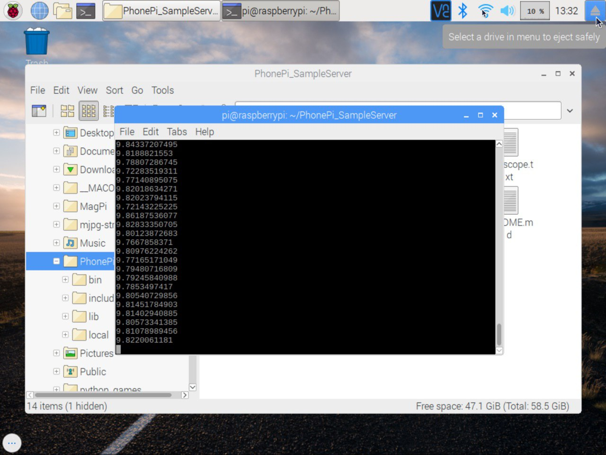
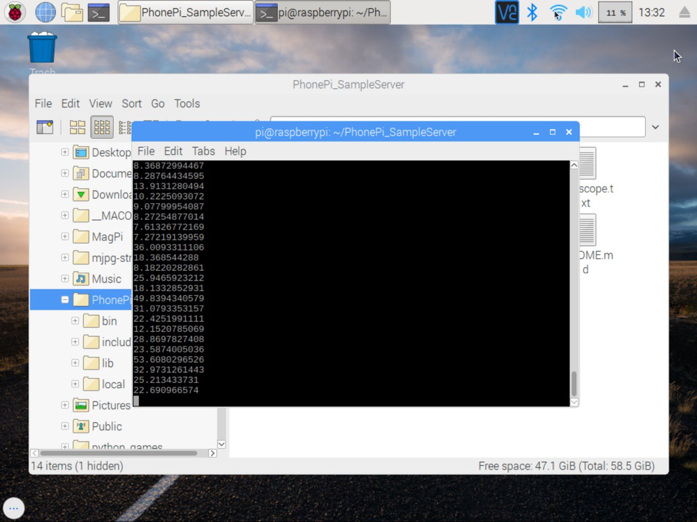
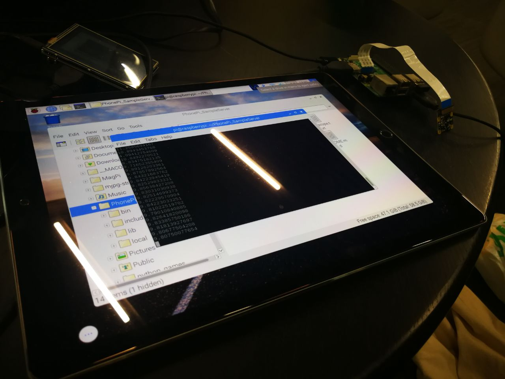
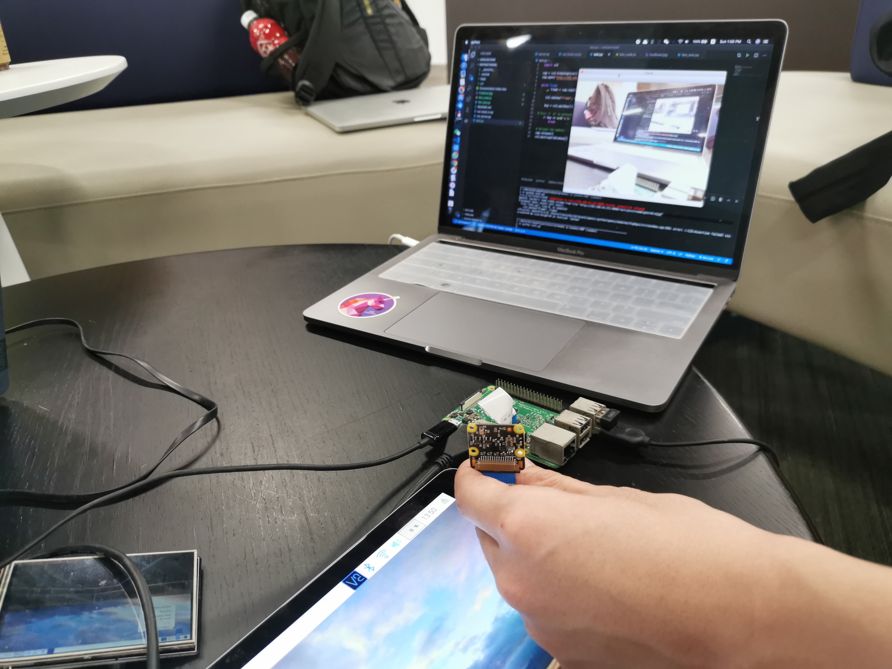
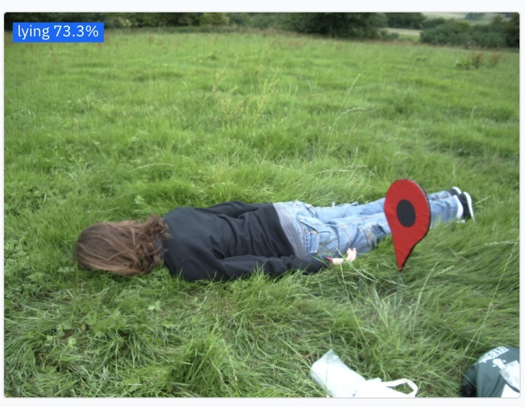

# Silver Defence
## Description

Our solution aims to provide immediate assistance to elderly, once there is an emergency in the house such as falling or non-appearance. At the same time, the solution achieves high accuracy for detecting serious incidents, such that resources are channeled efficiently. An accelerometer on wearables will be given to elderly, this device will detect a fall if the root sum square acceleration exceeds a preset threshold value. Our method also makes use of image classification using images from an IP camera, which is set up in the living room to take images. These images are processed using the Raspberry Pi server. Image classification is then conducted by IBM Cloud Annotation Services.


---

## Video Pitch 


[](http://www.youtube.com/watch?v=s02yc2wPgXE)

---

## Architecture Of Our Solution


---

## Project Roadmap/ Proposed timeline

Phase 1 - Research | Phase 2 - Testing | Phase 3 - Deployment
--- | --- | ---
Investigate what kind of wearables elderly are keen on having | Conduct studies to obtain test data for accelerometer implemented in finalised wearables | Implement in isolated elderly households
Investigate willingness of elderly about wearable technology | Input more train images into Tensorflow model | 
-|Test whole system on actual subjects for overall false alarm rate|

---

## Getting started

---
### IOT Flask Server

```sh
cd PiServer
pip install -r requirement.txt
python test.py
```

Require stream sensor data to the server, tested using android app 'PhonePi'

---
### Model

Our model is trained on IBM cloud annotation, classify images in 3 class
1. empty
2. lying
3. non lying
---
### Model testing

```sh
cd classification-react
yarn
yarn start
```

## Demo/ScreenShot

#### Normal Accelerometer Reading



#### Falling Accelerometer Reading



#### Setup



#### Camera Test



#### Classification



### Data File for training
Our training data under folder trainingData

---

## Service/Tech used to build your solution

1. IBM Cloud Annotation
2. Raspberry Pi 
3. Python Flask Server
4. Tensorflow Image Classification


## Detailed description of your solution

Our team has chosen to target the first problem statement, “Emergency Medical Services”. This problem statement focuses on leveraging analytics for better sense-making to be alerted at the onset of incidents of the elderly population, such as falls and acute diseases, which require emergency response.

As the percentage of elderly living alone has increased from 6.6% to 8.9% in the recent 15 years, many concerns have been raised regarding their wellbeing. According to the Health Promotion Board, about 33% of Singaporeans aged 65 and above have recurring falls. This number increases sharply with age. At the same time, falls may inflict severe injuries to this vulnerable population, with 20% of elderly dying within a year after their fall. Our solution, SilverDefence, addresses this pressing issue through constantly monitoring the safety of elderly living alone, using image classification and accelerometers on IOT devices. 

SilverDefence also tackles the trade-off between quick responses and saving lives. On one hand, we want to provide assistance immediately once there is an emergency in the house, hence reducing life loss. On the other hand, since SCDF resources are precious, we do not want to deploy emergency teams for something that is not serious. 

SilverDefence involves image classification using images from an IP camera as well as an accelerometer. The IP camera is set up in the living room as the living room is the common area of the house and has less privacy concerns. The images from the camera are processed using a Raspberry Pi server. Raspberry Pi is chosen as it is a much cheaper and more convenient IOT option than laptops & PC.

An accelerometer on a wearable is used to detect falls in the elderly. To obtain the magnitude of acceleration, the root sum square of accelerations in x, y, z directions are calculated. If the root sum square of acceleration exceeds a threshold value, it assumes a fall. When a fall is detected by the accelerometer, the IP camera double-checks the fall using image classification to see whether there is a person lying down in the video frames. The image classification training is conducted by IBM Cloud Annotation services. 

When the accelerometer shows normal readings, the IP camera is still working to detect whether there is movement in the living room. If there is no motion detected in 24 hours, an alert is raised as the elderly may have collapsed in another room. 

Therefore, the IOT application that we propose takes in data from our IP camera and accelerometer, and then uses IBM cloud models to decide whether to send an alert.

The data we used in our demo is from falldataset.com. As the training images are limited, the accuracy of our current model is not very high. Hence, further improvements can be made to our solution by improving on the quality of the training data, perhaps producing our own training images using actual HDB images. A higher accuracy can also be achieved with more sample images. 

In future, we can also use a depth camera instead of an IP camera; this helps to further protect privacy. We were unable to test our solution using a depth camera as we did not possess one.

Lastly, a possible extension is to have a voice assistant that will be activated when a fall is detected. It will ask if the elderly is okay, and if the elderly replies with “no” or does not reply, an alert is raised. This can be done using IBM’s text to speech and speech to text services, allowing the elderly to reply from wherever they are. The rationale for this is to add another layer of confirmation before sending an alert, further reducing false alarms or the unnecessary activation of emergency resources.

In conclusion, SilverDefence allows for quick response because the accelerometer and camera are detecting all the time and can send emergency alerts quickly. It also reduces false alarms since we used two layers of detection. Therefore, our solution effectively addresses the problem.


