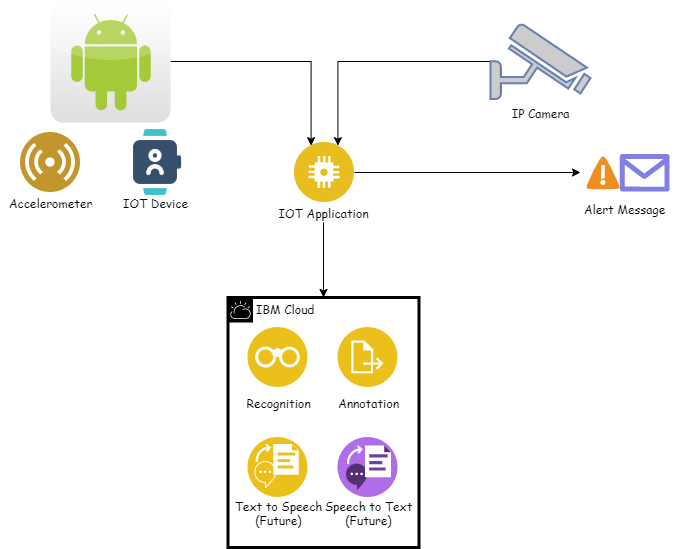

# Silver Defence
## Description

Our solution aims to provide immediate assistance to elderly, once there is an emergency in the house such as falling or non-appearance. At the same time, the solution achieves high accuracy for detecting serious incidents, such that resources are channeled efficiently. An accelerometer on wearables will be given to elderly, this device will detect a fall if the root sum square acceleration exceeds a preset threshold value. Our method also makes use of image classification using images from an IP camera, which is set up in the living room to take images. These images are processed using the Raspberry Pi server. Image classification is then conducted by IBM Cloud Annotation Services.


---

## Video Pitch 


[](http://www.youtube.com/watch?v=s02yc2wPgXE)

---

## Architecture Of Our Solution



---

## Project Roadmap/ Proposed timeline

---

## Getting started

---
### IOT Flask Server

```sh
cd PiServer
pip install -r requirement.txt
python test.py
```

Require stream sensor data to the server

---
### Model

Our model is trained on IBM cloud annotation, classify images in 3 class
1. empty
2. lying
3. non lying
---
### Model testing

```sh
cd classification-react
yarn
yarn start
```

### Data File for training
Our training data under folder trainingData

---

## Service/Tech used to build your solution

1. IBM Cloud Annotation
2. Raspberry Pi 
3. Python Flask Server
4. Tensorflow Image Classification
